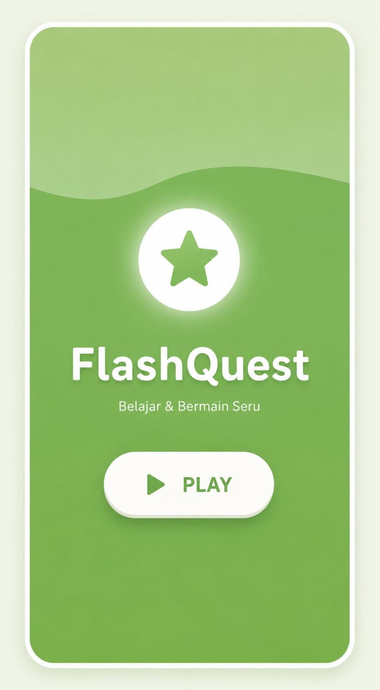
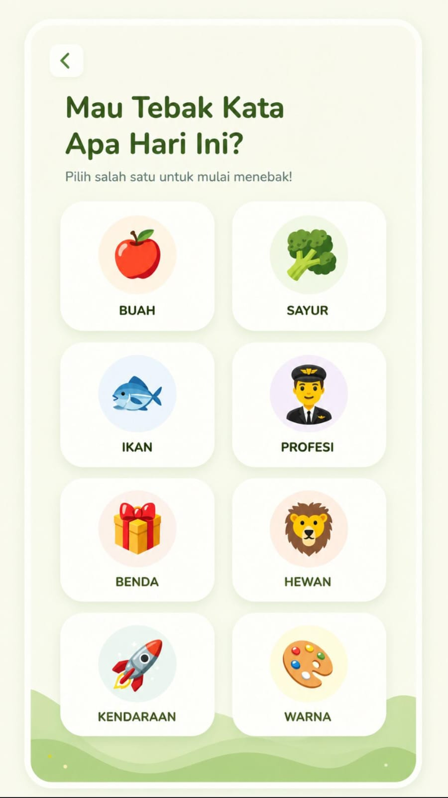
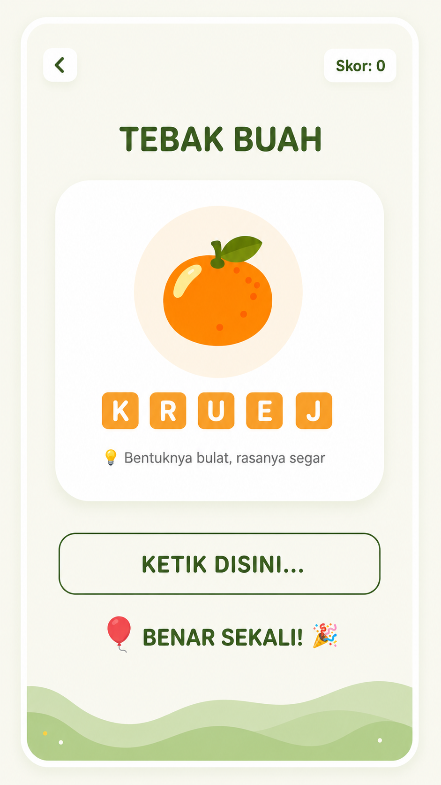
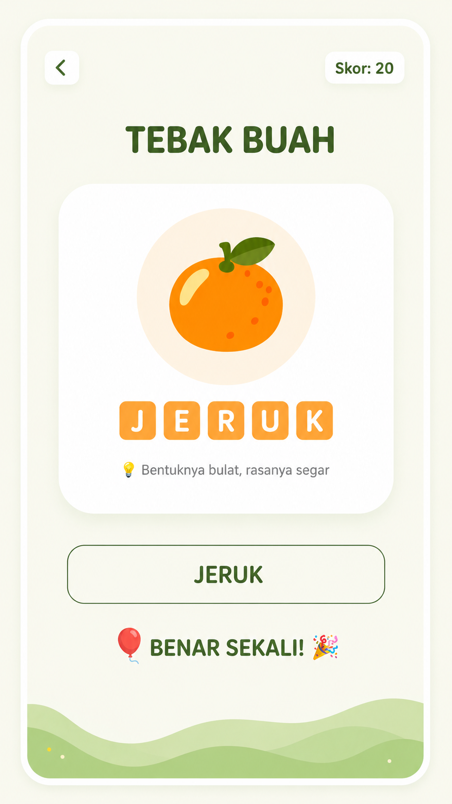
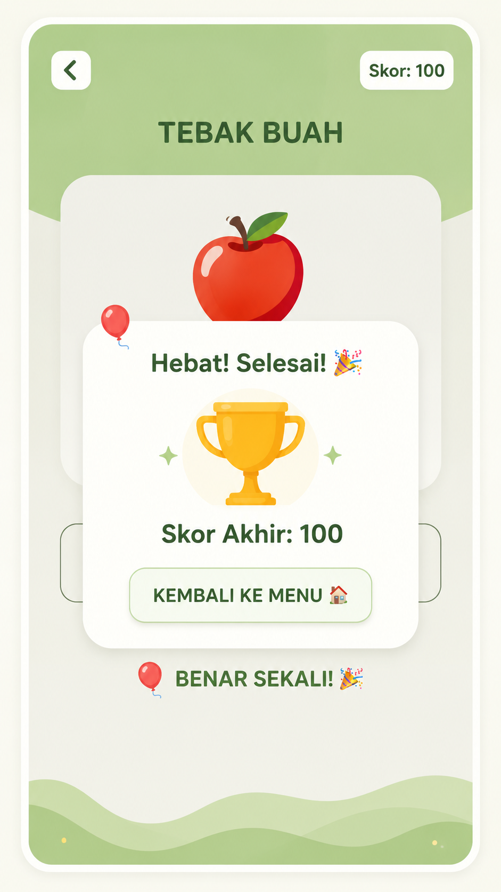

# BLUEPRINT (RENCANA KERJA APLIKASI)

# Nama Aplikasi: 🌟 FlashQuest - Belajar & Bermain Seru

*FlashQuest adalah aplikasi mobile edukatif berbasis flutter yang dirancang untuk membantu proses belajar melalui metode tebak kata bergambar yang interaktif dan menyenangkan dengan kategori yang beragam.*

# Konsep Visual & UI/UX (100% Match)
1. Warna Utama: Hijau (Colors.green / #4CAF50) melambangkan kesegaran dalam pembelajaran dan bermain.
2. Akses Warna: Putih Gading (#F1F8E9) untuk latar belakang agar mata tidak lelah.
3. Elemen Desain: 
   - Pengguna Wave Clipper (gelombang) pada menu utama dan header permainan untuk kesan dinamis.
   - Animated Floating Cards pada pemilihan kategori.
4. Sistem Paraticle/Balloons saat jawaban benar untuk meningkatkan user enggagement.
5. Tipografi: Bold Sans-Serif dengan letter spacing untuk judul agar terlihat modern.

# Fitur Utama
1. Menu Utama Dinamis: Animasi logo melayang dan tombol **PLAY** yang berdenyut (scaling).
2. Multi-Kategori: 8 Kategori pembelajaran (Buah, Sayur, Ikan, Profesi, Benda, Hewan, Kendaraan, dan warna)
3. Sistem Gameplay:
   - Acak Huruf (Scramble Letters).
   - Hint (Petunjuk teks) edukatif.
   - Sistem Skor real-time (20 poin per jawaban benar).
4. Feedback Visual: Animasi balon terbang sebagai bentuk perayaan keberhasilan. 
5. Game Over Dialog: Ringkasan skor akhir dan navigasi kembali.

# STACK TEKNOLOGI
1. Framework: Flutter (Dart)
2. State Management: Statefulwidget (Native)
3. Version Control: Git & Github

---

# 📸 Tampilan Aplikasi (UI Showcase)

Aplikasi ini menyusun tema **Nature Green** yang elegan dan bersih. Berikut adalah detail tampilannya:

1. **Main Menu:**
    Background gradasi hijau (`#4CAF50` KE `#8BC34A`) dengan efek gelombang putih atas. terdapat icon bintang melayang dan tombol PLAY dengan efek animasi detak jantung.
     
    

2. **Category Selection:**
    Menampilkan pilihan 8 kategori edukatif dengan warna-warna pastel (Orange, Hijau, Biru, Ungu) yang memiliki efek melayang (*floating animation*).
     
    

3. **Gameplay Screen:** 
    Header hijau melengkung, kartu soal putih dengan bayangan halus, petunjuk teks huruf yang diacak, dan kolom input yang responsif.
     
    

4. **Celebration:**
    Efek balon warna-warni yang terbang dari bawah ke atas serta muncul notifikasi **"BENAR SEKALI!"** sesaat setelah pengguna berhasil menebak kata.
     
    

5. **Game Over Dialog (Skor Akhir)**
    Dialog ringkasan skor akhir yang muncul setelah menyelesaikan semua soal di dalam suatu kategori, dilengkapi dengan tombol navigasi untuk kembali.
     
    
---

# 🏠 Fitur Utama

1. **Kategori Edukasi:**
    Tersedia Kategori Buah, Sayur, Ikan, Profesi, Benda, Hewan, Kendaraan, dan Warna.

2. **Smart Hint:**
    Setiap soal dilengkapi dengan petunjuk edukasi untuk membantu pengguna.

3. **Scrambled Word:**
    Huruf jawaban di acak secara otomatis untuk tantangan berfikir.

4. **Live Scoring:**
    Skor di hitung secara otomatis (Skor 100 untuk satu kategori penuh).

5. **Interactive UI:** 
    Menggunakan (CustomClippers) untuk desain lengkungan yang unik dan (Animations) untuk pengalaman pengguna yang halus.

---

# 🛠️ Detail Teknis

### Warna & Tema (Branding)
* **Primary Color:** `Colors.green` (Hijau Utama)
* **Secondary Color:** `Colors.lightGreen` (Hijau Muda)
* **Background:** `Color(0xFFF1F8E9)` (Putih Hijau)
* **Accent:** `Colors.orangeAccent` (Untuk teks huruf acak)

### Struktur Kode
* `MainMenuPage`: Mengatur animasi logo dan navigasi awal.
* `CategoryPage`: Grid interaktif untuk memilih kategori permainan.
* `WordGamePage`: Logika utama permainan, pemprosesan jawaban, dan sistem skor.
* `FloatingBalloons`: Widget khusus untuk animasi perayaan jawaban benar.

---

# 📖 Cara Kerja Aplikasi
1. Pengguna membuka aplikasi dan menekan tombol **PLAY** di Menu Utama.
2. Pengguna memilih salah satu dari **8 kategori** yang tersedia.
3. Gambar emoji dan huruf yang teracak akan muncul beserta petunjuk teks.
4. Pengguna menggentik jawaban pada kolom **KETIK DISINI...**
5. Jika benar, balon akan muncul dan soal otomatis berpindah. 
6. Di akhir sesi, dialog **Skor Akhir** akan ditampilkan.

# Intruksi Penyimpanan Proyek Ke GIT (Commit)
Sesuai instruksi untuk melakukan pembaruan berkala dan dilarang melakukan satu kali push langsung selesai di akhir, aba-aba perintah terminal berikut digunakan setiap  kali selesai mencicil fitur:
* 'git ststus' (Melihat file yang diubah)
* 'git add .' (Menambah perubahan ke staging area)
* 'git commit -m "feat: deskripsi progres fitur"' (Memberikan catatan commit)
* 'git push origin main' (Mengirim berkas ke GitHub)

© 2026 Serly Dwi Rahayu - Teknik Informatika